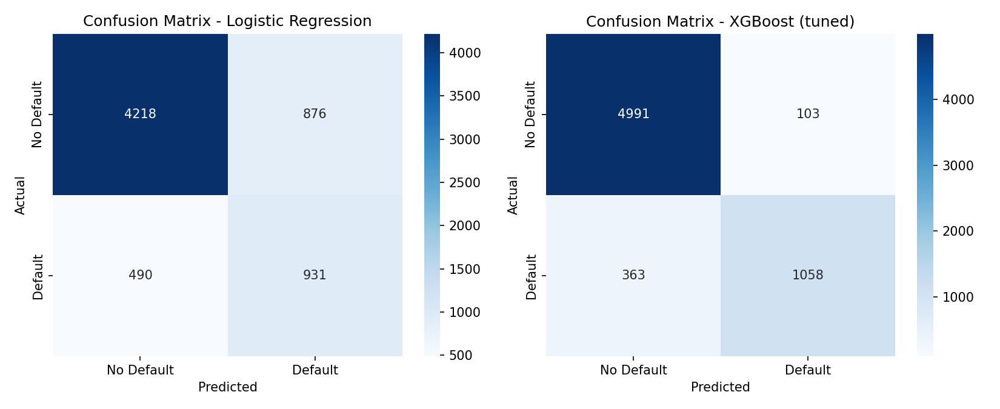
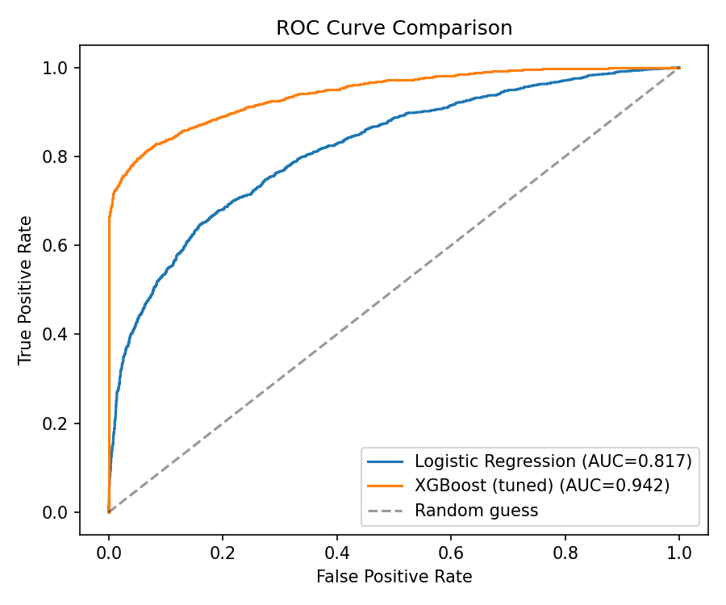
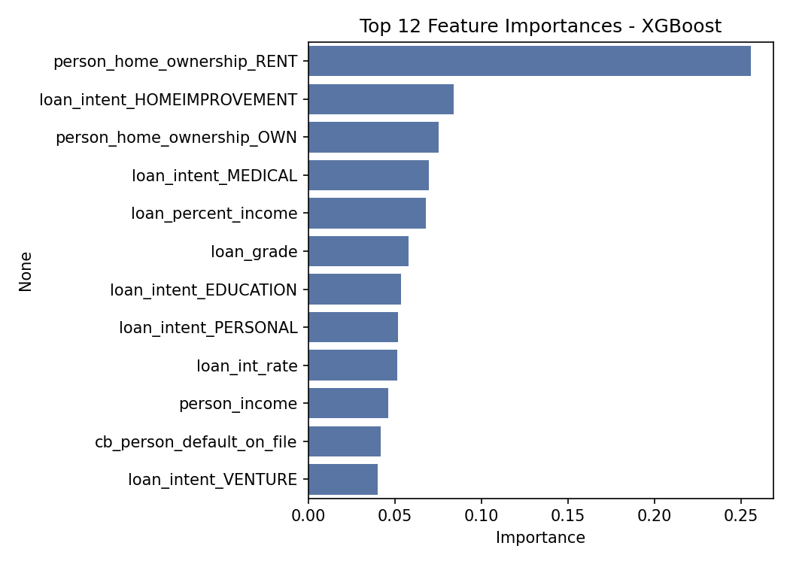

# Credit Risk Prediction Model

A machine learning project that predicts whether a loan applicant will default on their loan, using Logistic Regression and XGBoost. Built on the [Kaggle Credit Risk Dataset](https://www.kaggle.com/datasets/laotse/credit-risk-dataset) (~32,500 loan applications).

## Results

| Model | Accuracy | Precision | Recall | F1-score | ROC-AUC |
|---|:---:|:---:|:---:|:---:|:---:|
| Logistic Regression | 79.0% | 0.52 | 0.66 | 0.58 | 0.817 |
| **XGBoost (tuned)** | **92.8%** | **0.91** | **0.74** | **0.82** | **0.942** |





## Project Structure
credit-risk-model/
├── data/
│ └── credit_risk_dataset.csv
├── notebooks/
│ └── credit_risk_model.ipynb
├── models/
│ ├── logistic_regression.pkl
│ ├── xgboost_model.pkl
│ └── scaler.pkl
├── images/
│ ├── confusion_matrices.png
│ ├── roc_curve.png
│ └── feature_importance.png
├── requirements.txt
└── README.md

## Dataset

32,574 loan applications (after cleaning) with applicant demographics, income, employment length, loan details, and credit history. Target: `loan_status` (1 = default, 0 = repaid), imbalanced at ~78% repaid / 22% defaulted.

## Pipeline

1. **Data cleaning** — removed rows with impossible values (e.g. age 144, employment length 123 years), which were clear data entry errors. Imputed missing values in `person_emp_length` and `loan_int_rate` using the median, chosen over the mean because both features are right-skewed.
2. **Feature engineering** — ordinal encoding for `loan_grade` (A–G, since it has a real order), one-hot encoding for nominal categoricals (`person_home_ownership`, `loan_intent`), binary encoding for `cb_person_default_on_file`.
3. **Stratified 80/20 train-test split** — preserves the ~78/22 class ratio in both sets.
4. **SMOTE** — applied only to the training set (after splitting) to balance the classes and avoid data leakage into the test set.
5. **Logistic Regression** — trained as an interpretable baseline, features scaled with `StandardScaler`.
6. **XGBoost** — tuned via `RandomizedSearchCV` (25 iterations, 5-fold stratified CV, optimizing ROC-AUC) over 7 hyperparameters.
7. **Evaluation** — accuracy, precision, recall, F1, ROC-AUC, confusion matrix, and feature importance.

## Key Finding

`person_home_ownership_RENT` was the single most important feature. Verified against actual data: renters default at **31.6%** vs **11.9%** for owners/mortgage-holders — renting is a strong proxy for lower financial stability rather than a direct cause of default.

## How to Run

```bash
pip install -r requirements.txt
```
Then open `notebooks/credit_risk_model.ipynb` and run all cells.

## Tech Stack

Python, pandas, scikit-learn, XGBoost, imbalanced-learn (SMOTE), matplotlib, seaborn.